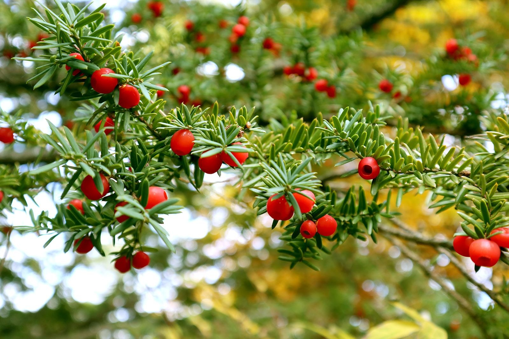
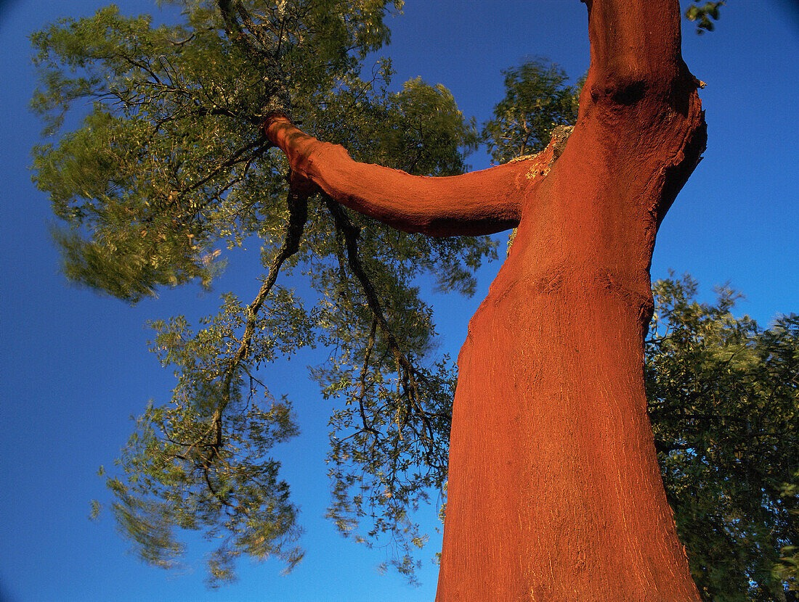

# Damalerio-Nikko_LW2A_Plant_Species_Image_Classification

## A. Project Overview

### ● Brief Description of the Project

This project involves building an image classification model using a collection of unique tree and plant species. All images were gathered manually and organized into folders to create a clean dataset. The model is trained using Teachable Machine to identify and distinguish between the different plant types.  

The main goal is to explore how machine learning models interpret visual data, how they learn to differentiate species, and how dataset quality impacts classification performance.

### ● Purpose of the Image Classification Model

The purpose of this model is:

- To accurately classify a variety of tree and plant species from images  
- To study how AI recognizes visual features and patterns  
- To gain hands-on experience in preparing datasets, training models, and evaluating predictions using Teachable Machine

## B. Plant Species Overview

Below are the 20 plant species used in this image classification project. Each species includes one representative image and a short description.

---

### 1. Kauri Tree

- Common Name: Kauri Tree  
- Scientific Name: *Agathis australis*  
- Description: Kauri trees are massive, long-living conifers native to New Zealand. They are known for their straight trunks, thick bark, and highly durable wood.  

---

### 2. Japanese Yew

- Common Name: Japanese Yew  
- Scientific Name: *Taxus cuspidata*  
- Description: The Japanese Yew is an evergreen conifer native to Japan, prized for its dense foliage and used in ornamental landscaping and bonsai cultivation.  

---

### 3. Hainan Yellowwood

- Common Name: Hainan Yellowwood  
- Scientific Name: *Dalbergia odorifera*  
- Description: A tropical tree known for its fragrant wood and durable timber, native to Hainan Island in China.  

---

### 4. Ghost Gum

- Common Name: Ghost Gum  
- Scientific Name: *Corymbia aparrerinja*  
- Description: Native to central Australia, Ghost Gum is a smooth-barked tree with white trunks and delicate green leaves, often seen in arid regions.  

---

### 5. Western Silvery Oak

- Common Name: Western Silvery Oak  
- Scientific Name: *Grevillea robusta*  
- Description: Also called the Silk Oak, this fast-growing tree from Australia is known for its feathery leaves and bright orange flowers.  

---

### 6. Sumatran Rafflesia

- Common Name: Sumatran Rafflesia  
- Scientific Name: *Rafflesia arnoldii*  
- Description: Known for producing the largest flowers in the world, this parasitic plant from Sumatra has a distinctive odor and unique red-orange blooms.  

---

### 7. Sierra Magnolia

- Common Name: Sierra Magnolia  
- Scientific Name: *Magnolia campbellii*  
- Description: A striking magnolia species from the Himalayas, notable for its large, pink to red flowers that bloom early in spring.  

---

### 8. Borneo Camphor Tree

- Common Name: Borneo Camphor Tree  
- Scientific Name: *Dryobalanops aromatica*  
- Description: This tall tropical tree from Borneo produces fragrant camphor and is valued for its hard, durable timber.  

---

### 9. Cork Oak

- Common Name: Cork Oak  
- Scientific Name: *Quercus suber*  
- Description: Native to southwestern Europe and North Africa, the Cork Oak is known for its thick, cork-producing bark and evergreen leaves.  

---

### 10. Himalayan Cedar

- Common Name: Himalayan Cedar  
- Scientific Name: *Cedrus deodara*  
- Description: An evergreen conifer native to the western Himalayas, valued for its aromatic wood and ornamental uses.  

---

### 11. Dove Tree

- Common Name: Dove Tree  
- Scientific Name: *Davidia involucrata*  
- Description: Known for its distinctive white bracts resembling doves, this deciduous tree is native to China and widely planted as an ornamental species.  

---

### 12. Macadamia Nut Tree

- Common Name: Macadamia Nut Tree  
- Scientific Name: *Macadamia integrifolia*  
- Description: Native to Australia, this evergreen tree produces edible nuts and has glossy green foliage.  

---

### 13. Florida Torreya

- Common Name: Florida Torreya  
- Scientific Name: *Torreya taxifolia*  
- Description: A critically endangered conifer native to Florida, known for its slender, pyramidal shape and dark green needles.  

---

### 14. Tamarind Tree

- Common Name: Tamarind Tree  
- Scientific Name: *Tamarindus indica*  
- Description: A tropical tree producing edible, tangy-sweet pods; widely cultivated in Asia, Africa, and the Americas.  

---

### 15. Palo Verde

- Common Name: Palo Verde  
- Scientific Name: *Parkinsonia florida*  
- Description: Known as the "green stick" tree, this desert species from North America has green bark and yellow flowers.  

---

### 16. Giant Sequoia

- Common Name: Giant Sequoia  
- Scientific Name: *Sequoiadendron giganteum*  
- Description: One of the largest tree species on Earth, native to California, with massive trunks and reddish-brown bark.  

---

### 17. Norfolk Island Pine

- Common Name: Norfolk Island Pine  
- Scientific Name: *Araucaria heterophylla*  
- Description: A tall, evergreen conifer native to Norfolk Island, characterized by its straight trunk, dense pyramidal shape, and horizontal branching pattern. Often cultivated as an ornamental houseplant.  

---

### 18. Dwarf Cypress

- Common Name: Dwarf Cypress  
- Scientific Name: *Chamaecyparis obtusa ‘Nana’*  
- Description: A slow-growing, compact conifer used in bonsai and landscaping; has dense, dark green foliage.  

---

### 19. Living Stone Tree

- Common Name: Living Stone Tree  
- Scientific Name: *Euphorbia tirucalli*  
- Description: A succulent tree with cylindrical, stick-like branches, commonly called Pencil Cactus or Milk Bush; adapted to arid environments.  

---

### 20. Bottlebrush Tree

- Common Name: Bottlebrush Tree  
- Scientific Name: *Callistemon*  
- Description: Known for its bright red, brush-like flowers, this tree is native to Australia and commonly used in ornamental landscaping.

---

## C. Model Training Details

### ● Epochs
150

### ● Batch Size
160

### ● Learning Rate
0.001

### ● Number of Images Per Class
250-300 (unbalanced distribution across classes)

  
